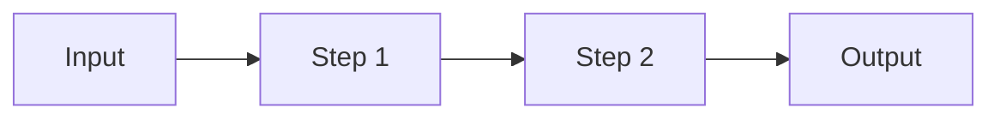
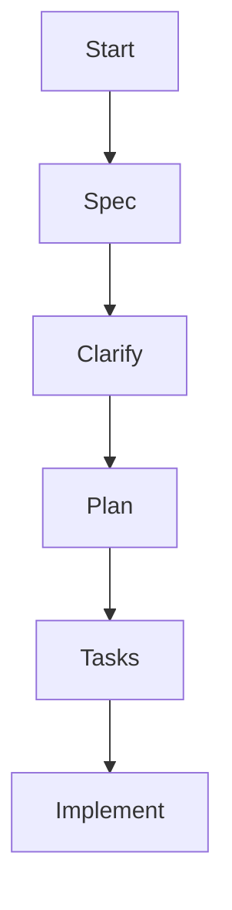
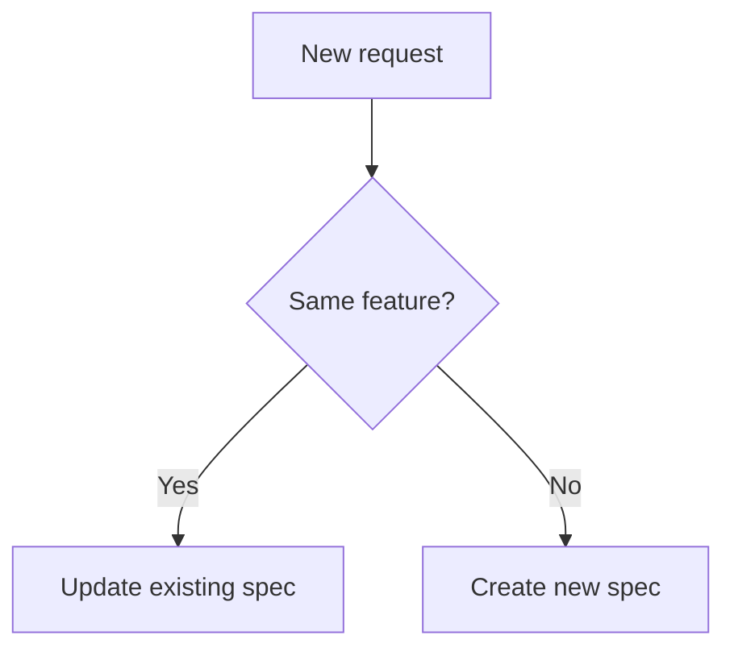
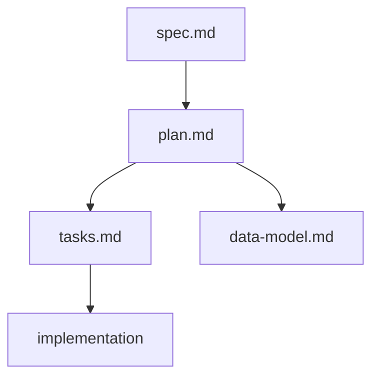

# Mermaid Patterns

Use Mermaid only when it materially improves comprehension.

## 1. Linear Workflow

Use for a standard end-to-end process.



## 2. Stepwise Main Flow

Use for a canonical multi-step workflow with ordered stages.



## 3. Branching Decision Flow

Use when the guide needs path selection logic.



## 4. Document Relationship Flow

Use when explaining how artifacts feed each other.



## When To Skip Mermaid

Skip Mermaid when:

- a simple bullet list is clearer
- the topic is too small for a diagram
- the diagram would restate an obvious sequence

## Tree Diagrams

For file and folder structures, prefer a Markdown code block over Mermaid:

```text
project/
├─ docs/
│  └─ guide.md
└─ specs/
   └─ 001-feature/
```

Add a short inline comment after each important item when structure explanation matters.
