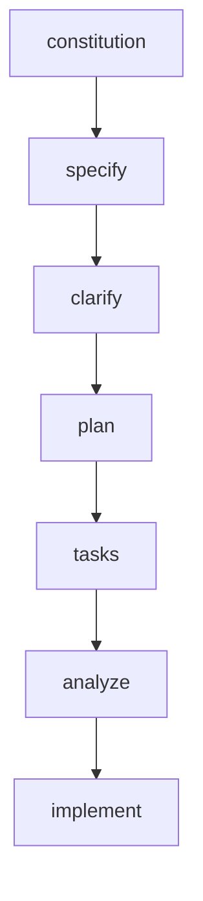
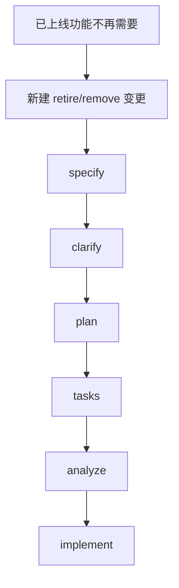
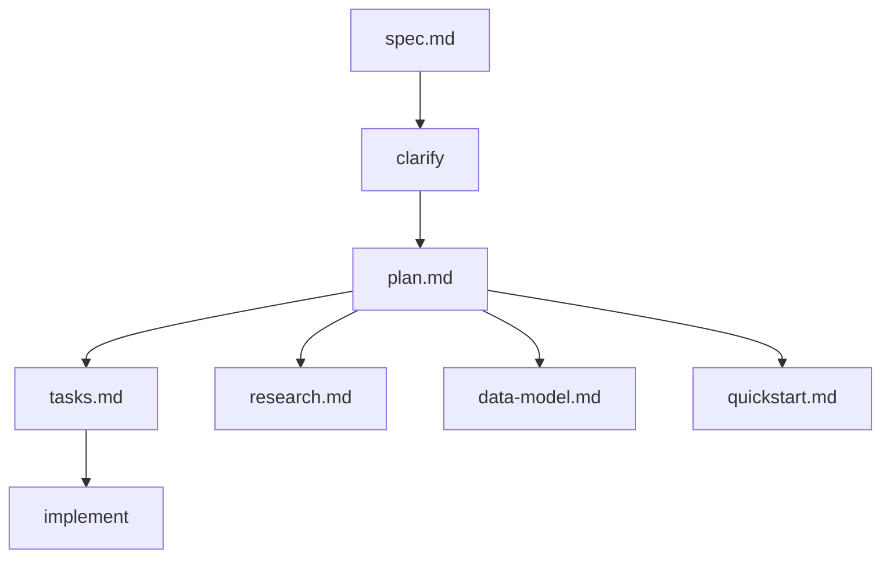

# Speckit + Codex 使用指南

本文面向已经上手过一次、但需要建立稳定使用框架的场景。重点是：

- 在哪里用什么命令
- 标准工作流怎么走
- 不同场景怎么分流
- `specs/`、`docs/`、`.specify/` 分别放什么
- 功能迭代、独立新功能、功能退役应该怎么管理

---

## 1. 概览

Speckit 的核心作用不是替代编码，而是把需求、澄清、方案、任务、实现串成一条可追踪流程：

`Spec -> Clarify -> Plan -> Tasks -> Analyze -> Implement`

对应关系：

- `Spec`：定义做什么
- `Clarify`：消除关键歧义
- `Plan`：确定怎么做
- `Tasks`：拆成可执行任务
- `Analyze`：检查文档是否一致
- `Implement`：按任务落地


---

## 2. 使用环境与初始化

先分清两个环境。

| 环境 | 用途 | 典型命令 |
|------|------|----------|
| PowerShell / 终端 | 初始化、登录、启动 Codex | `specify init`、`gh auth login`、`codex` |
| Codex 交互窗口 | 执行 speckit 工作流 | `$speckit-specify`、`$speckit-plan` |

结论：

- `specify init ...` 在终端里执行
- `$speckit-*` 在 Codex 窗口里执行
- 不要在普通终端里输入 `$speckit-*`

### 2.1 初始化最小流程

1. 确认 `specify` 已安装并指向正确版本
2. 在项目根目录执行初始化
3. 必要时配置 GitHub Token
4. 启动 `codex`
5. 在 Codex 中使用 `$speckit-*`

### 2.2 初始化常见命令

根据你当前使用过的方式，典型初始化命令是：

```powershell
specify init . --ai codex --ai-skills --force
```

如果需要 GitHub 认证以避免 API 限流：

```powershell
gh auth login
$env:GITHUB_TOKEN = gh auth token
```

然后启动 Codex：

```powershell
codex
```

进入 Codex 后，再执行：

```text
$speckit-specify ...
```

---

## 3. 标准使用流程

标准流程：

`constitution -> specify -> clarify -> plan -> tasks -> analyze -> implement`



3 条关键规则：

- `constitution` 是项目级规则，不是每个需求都要重跑
- `clarify` 在 `plan` 之前
- `analyze` 在 `implement` 之前

### 3.1 `constitution`

- 目标：定义项目级规则
- 何时用：第一次建立项目规范，或项目规则变化时
- 输入：项目级原则、约束、开发要求
- 输出：`.specify/memory/constitution.md`

示例：

```text
$speckit-constitution 为当前项目建立规则：所有功能必须先 spec 再 plan；所有前端改动必须验证桌面端和移动端；数据结构变更必须同步更新文档。
```

### 3.2 `specify`

- 目标：定义某个功能要做什么
- 何时用：新增需求、更新需求、下线需求
- 输入：自然语言需求说明
- 输出：对应 feature 目录下的 `spec.md`

示例：

```text
$speckit-specify 为旅行攻略网站新增“景点筛选与详情联动”功能。用户可以按主题筛选景点，并在列表和详情之间联动浏览。
```

### 3.3 `clarify`

- 目标：消除对实现影响较大的歧义
- 何时用：`specify` 之后，`plan` 之前
- 输入：当前 feature 的 `spec.md`
- 输出：澄清后的 `spec.md`

示例：

```text
$speckit-clarify 请针对当前“景点筛选与详情联动”spec 进行澄清，优先确认筛选逻辑、默认状态、移动端交互和详情展示方式。
```

### 3.4 `plan`

- 目标：确定怎么做
- 何时用：需求边界基本明确后
- 输入：当前 feature 的 `spec.md` 与澄清结果
- 输出：`plan.md`，以及可能的 `research.md`、`data-model.md`、`quickstart.md`

示例：

```text
$speckit-plan 基于当前“景点筛选与详情联动”spec 和澄清结果，生成实现方案，重点明确交互流程、状态管理、数据结构和验证方式。
```

### 3.5 `tasks`

- 目标：把实现方案拆成可执行任务
- 何时用：`plan` 完成后
- 输入：`plan.md` 及相关设计产物
- 输出：`tasks.md`

示例：

```text
$speckit-tasks 基于当前 implementation plan 拆分任务，按交互、数据、样式适配和验证分组。
```

### 3.6 `analyze`

- 目标：检查 `spec / plan / tasks` 是否一致
- 何时用：`tasks` 完成后、`implement` 之前
- 输入：`spec.md`、`plan.md`、`tasks.md`
- 输出：一致性分析报告

示例：

```text
$speckit-analyze 请检查当前功能的 spec、plan、tasks 是否一致，重点关注需求覆盖、状态遗漏和移动端适配。
```

### 3.7 `implement`

- 目标：按任务实现
- 何时用：文档已经收敛并完成检查后
- 输入：`tasks.md` 及相关设计文档
- 输出：代码改动与验证结果

示例：

```text
$speckit-implement 按当前 tasks 实现“景点筛选与详情联动”功能，并验证桌面端和移动端行为。
```

---

## 4. 命令说明

这一章只做职责速查，不重复展开场景。

| 命令 | 作用 | 典型输入 | 典型产出 |
|------|------|----------|----------|
| `$speckit-constitution` | 建立或更新项目规则 | 项目原则 | `constitution.md` |
| `$speckit-specify` | 定义功能需求 | 功能描述 | `spec.md` |
| `$speckit-clarify` | 澄清关键歧义 | 当前 spec | 更新后的 `spec.md` |
| `$speckit-plan` | 生成实现方案 | spec + 澄清 | `plan.md` 等 |
| `$speckit-tasks` | 拆分任务 | plan | `tasks.md` |
| `$speckit-analyze` | 检查一致性 | spec/plan/tasks | 分析报告 |
| `$speckit-implement` | 实施任务 | tasks | 代码改动 |

---

## 5. 场景分流

核心思路不是死记命令，而是先判断自己处于什么场景。

### 5.1 第一次完整做一个需求

适用条件：

- 当前要做的是一个明确的新需求
- 需要从需求定义一直走到实现

推荐流程：

`constitution -> specify -> clarify -> plan -> tasks -> analyze -> implement`

示例：

```text
$speckit-constitution 为当前项目建立规则：先 spec 再 plan；所有前端改动必须验证桌面端和移动端。
```

```text
$speckit-specify 为旅行攻略网站新增“景点筛选与详情联动”功能。用户可以按主题筛选景点，并在列表和详情之间联动浏览。
```

```text
$speckit-clarify 请针对当前“景点筛选与详情联动”spec 进行澄清，优先确认筛选逻辑、默认状态、详情展示方式和移动端交互。
```

```text
$speckit-plan 基于当前 spec 和澄清结果生成实现方案，重点明确交互流程、状态管理、数据结构和验证方式。
```

```text
$speckit-tasks 基于当前 plan 拆分任务，按交互、数据、样式和验证分组。
```

```text
$speckit-analyze 请检查当前 spec、plan、tasks 是否一致。
```

```text
$speckit-implement 按当前 tasks 开始实现，并验证桌面端和移动端。
```

### 5.2 在已有功能上迭代

适用条件：

- 仍属于原 feature 的增强
- 不是新的独立功能

典型例子：

- 给筛选功能增加多选
- 记住上次筛选条件
- 增加过渡动画

推荐流程：

`specify -> clarify -> plan -> tasks -> analyze -> implement`

示例：

```text
$speckit-specify 在当前“景点筛选与详情联动”功能 spec 基础上继续迭代，新增多选筛选、记住上次筛选条件和详情切换过渡动画。
```

### 5.3 新增独立功能

适用条件：

- 有独立用户目标
- 有独立主流程
- 可独立上线
- 引入独立核心数据或交互

典型例子：

- 收藏景点
- 地图浏览模式
- AI 生成行程

推荐做法：

- 新建新的 feature 目录
- 不要把它塞进旧 spec

示例：

```text
$speckit-specify 为旅行攻略网站新增“用户收藏景点”独立功能。用户可以在列表和详情中收藏景点，并在单独的收藏视图中查看和跳转。
```

### 5.4 删除 / 下线 / 退役功能

不要直接删代码，也不要假装原 feature 从未存在。

推荐做法：

- 保留原 feature 历史
- 新建 `retire-*` 或 `remove-*` 变更目录



示例：

```text
$speckit-specify 为旅行攻略网站下线“地图浏览模式”功能。请移除地图入口、地图视图、相关状态逻辑和文档引用，并确保不影响现有景点浏览主流程。
```

### 5.5 只做一致性检查

适用条件：

- 已经有 `spec.md`、`plan.md`、`tasks.md`
- 还不想立刻实现
- 想先做一次文档质量闸门

示例：

```text
$speckit-analyze 请检查当前 feature 的 spec、plan、tasks 是否一致，重点关注覆盖率、术语一致性和遗漏风险。
```

---

## 6. 新建 spec / 复用旧 spec / 新建 retire spec 的判断规则

| 情况 | 处理方式 |
|------|----------|
| 原功能增强 | 继续用旧 spec |
| 独立功能 | 新建 spec |
| 下线整个功能 | 新建 retire/remove spec |

判断维度：

- 是否有独立用户目标
- 是否可独立上线
- 是否有独立主流程
- 是否引入独立核心数据
- 是否是完整退役动作

项目内例子：

- 筛选加多选：旧 spec
- 收藏景点：新 spec
- 下线地图模式：retire spec

---

## 7. 完整文件结构图

这是推荐的完整文档结构，带注释。

```text
trip/
├─ .specify/
│  ├─ memory/
│  │  └─ constitution.md
│  │     # 项目级开发规则，约束所有 feature
│  ├─ scripts/
│  │  # speckit 工作流脚本
│  ├─ templates/
│  │  # spec/plan/tasks 等模板
│  └─ integrations/
│     # Codex / speckit 集成配置
│
├─ .agents/
│  └─ skills/
│     ├─ speckit-constitution/
│     ├─ speckit-specify/
│     ├─ speckit-clarify/
│     ├─ speckit-plan/
│     ├─ speckit-tasks/
│     ├─ speckit-analyze/
│     └─ speckit-implement/
│        # Codex 中通过 $speckit-* 调用的 skills
│
├─ specs/
│  ├─ 001-scenic-filter-linkage/
│  │  ├─ spec.md
│  │  │  # 需求规格：做什么、为什么做、验收标准
│  │  ├─ plan.md
│  │  │  # 实现方案：怎么做、约束、验证策略
│  │  ├─ tasks.md
│  │  │  # 任务拆分：顺序、依赖、并行机会
│  │  ├─ research.md
│  │  │  # 研究与关键决策记录
│  │  ├─ data-model.md
│  │  │  # 当前 feature 的数据模型
│  │  ├─ quickstart.md
│  │  │  # 快速验证和主流程检查
│  │  ├─ contracts/
│  │  │  # 接口/协议/UI 交互契约
│  │  ├─ checklists/
│  │  │  # UX/测试/发布检查项
│  │  └─ summary.md
│  │     # feature 摘要、状态、后续变更关联
│  │
│  ├─ 002-user-favorites/
│  │  # 第二个独立 feature
│  │
│  ├─ 003-map-browse-mode/
│  │  # 已上线 feature
│  │
│  └─ 004-retire-map-browse-mode/
│     ├─ spec.md
│     ├─ plan.md
│     ├─ tasks.md
│     └─ summary.md
│        # 对 003 的退役变更，保留历史，不抹掉原 feature
│
├─ docs/
│  ├─ architecture/
│  │  # 全局架构说明
│  ├─ domain/
│  │  # 共享领域模型
│  ├─ shared-flows/
│  │  # 跨 feature 共享交互流程
│  ├─ decisions/
│  │  # 稳定决策记录
│  └─ glossary.md
│     # 统一术语表
│
├─ AGENTS.md
│  # 给 Codex/agent 的项目上下文入口
│
└─ README.md
   # 给人看的项目入口说明
```

结构原则：

- `.specify/`：工作流基础设施
- `.agents/skills/`：Codex 调用入口
- `specs/`：feature 生命周期文档
- `docs/`：共享知识库

---

## 8. 单个 feature 目录结构说明

一个 feature 目录建议包含：

- `spec.md`：需求规格
- `plan.md`：实现方案
- `tasks.md`：执行任务
- `research.md`：研究与决策
- `data-model.md`：数据模型
- `quickstart.md`：快速验证
- `contracts/`：接口或交互契约
- `checklists/`：检查项
- `summary.md`：摘要、状态、后续变更

文档关系：



---

## 9. 共享文档结构与引用方式

### 9.1 哪些内容应抽到 `docs/`

适合放进共享文档的内容：

- 领域模型
- 跨 feature 通用交互规则
- 稳定架构说明
- 通用决策记录
- 术语表

### 9.2 哪些内容应留在 feature 内

适合留在 feature 文档中的内容：

- 当前功能的目标
- 当前功能的特殊约束
- 该 feature 的数据增量
- 该 feature 的任务、验证和退役记录

### 9.3 引用方式

推荐直接写明确路径，不复制大段共享内容。

示例：

```md
Canonical spot fields follow `docs/domain/spot-data-model.md`.
Navigation behavior follows `docs/shared-flows/navigation-patterns.md`.
```

原则：

- 共享文档写通用事实
- feature 文档只写本 feature 的差异和应用方式

---

## 10. Feature 状态与历史管理

推荐状态：

- `Draft`
- `Clarified`
- `Planned`
- `In Progress`
- `Released`
- `Deprecated`
- `Retired`
- `Archived`

建议写在：

- `spec.md` 顶部
- 或 `summary.md`

原则：

- 不删除已上线 feature 的历史文档
- 功能被取消时，新增退役变更目录
- 状态更新要能反映 feature 当前所处阶段

例如：

- `003-map-browse-mode/`：保留上线历史
- `004-retire-map-browse-mode/`：记录退役动作

---

## 11. 常见错误

| 错误 | 正确方式 |
|------|----------|
| 在终端中输入 `$speckit-*` | 在 Codex 窗口中输入 `$speckit-*` |
| 把独立功能塞进旧 spec | 为独立功能新建 feature 目录 |
| 跳过 `clarify` | 在 `plan` 前完成关键澄清 |
| 没有 `tasks` 就直接 `implement` | 先完成 `tasks`，必要时先做 `analyze` |
| 删除功能时直接删代码 | 新建退役变更并保留原 feature 历史 |
| 共享规则复制到每个 feature | 抽到 `docs/`，feature 内只引用和补差异 |
| feature 已退役但未更新状态 | 在 `spec.md` 或 `summary.md` 维护状态 |

---

## 12. 快速总结

标准流程：

`constitution -> specify -> clarify -> plan -> tasks -> analyze -> implement`

场景分流：

- 原功能增强：继续用旧 spec
- 独立新功能：新建 spec
- 下线整个功能：新建 retire/remove spec

环境区分：

- 终端：初始化、认证、启动 Codex
- Codex：执行 `$speckit-*`

结构速记：

- `.specify/`：工作流
- `.agents/skills/`：skill 入口
- `specs/`：feature 文档
- `docs/`：共享知识库

---

## 13. 附录：完整案例

### 13.1 新需求案例：景点筛选与详情联动

```text
$speckit-specify 为旅行攻略网站新增“景点筛选与详情联动”功能。用户可以按主题筛选景点，并在列表和详情之间联动浏览。
```

```text
$speckit-clarify 请针对当前 spec 进行澄清，优先确认筛选逻辑、默认状态、详情展示方式和移动端交互。
```

```text
$speckit-plan 基于当前 spec 和澄清结果生成实现方案，重点明确交互流程、状态管理、数据结构和验证方式。
```

```text
$speckit-tasks 基于当前 plan 拆分任务，按交互、数据、样式适配和验证分组。
```

```text
$speckit-analyze 请检查当前 spec、plan、tasks 是否一致。
```

```text
$speckit-implement 按当前 tasks 开始实现，并验证桌面端和移动端。
```

### 13.2 迭代案例：筛选支持多选 + 记住条件

```text
$speckit-specify 在当前“景点筛选与详情联动”功能 spec 基础上继续迭代，新增多选筛选和记住上次筛选条件。
```

```text
$speckit-clarify 请针对当前迭代后的 spec 做澄清，重点确认多选逻辑和筛选条件持久化范围。
```

```text
$speckit-plan 基于更新后的 spec 和澄清结果，调整当前实现方案。
```

```text
$speckit-tasks 基于更新后的 plan 重新整理任务。
```

```text
$speckit-analyze 请检查追加需求后的 spec、plan、tasks 是否一致。
```

```text
$speckit-implement 按更新后的 tasks 实现追加需求。
```

### 13.3 退役案例：下线地图浏览模式

```text
$speckit-specify 为旅行攻略网站下线“地图浏览模式”功能。请移除地图入口、地图视图、相关状态逻辑和文档引用，并确保不影响现有景点浏览主流程。
```

```text
$speckit-clarify 请针对当前退役变更 spec 做澄清，重点确认删除范围、兼容处理和回归验证范围。
```

```text
$speckit-plan 基于当前退役 spec 生成退役方案，重点明确入口清理顺序、状态移除范围和回归验证方式。
```

```text
$speckit-tasks 基于当前退役 plan 拆分任务，按入口移除、状态清理、文档同步和回归验证分组。
```

```text
$speckit-analyze 请检查当前退役变更的 spec、plan、tasks 是否一致。
```

```text
$speckit-implement 按当前 tasks 实施退役变更，并验证主流程不受影响。
```
