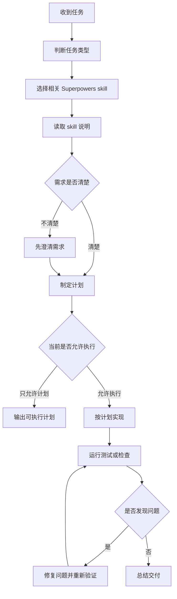
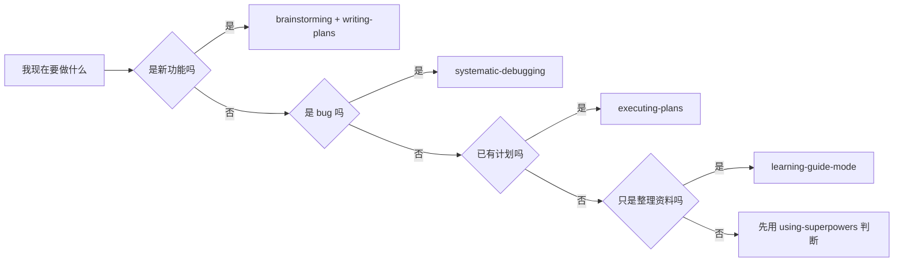

# Superpowers 小白快速上手指南

## 核心结论

Superpowers 的核心价值不是“多几个命令”，而是让 AI 编程助手按稳定流程工作。它通过一组 `skill` 约束 AI 的行为，减少需求不清就开工、修 bug 靠猜、完成前不验证这类问题。

新手先记住一句话：

```text
先判断任务，再选择 skill；先读规则，再开始行动；执行之后，必须验证。
```

## 基础概念

- `Skill`：一套具体工作方法，例如需求澄清、写计划、执行计划、系统调试、完成前验证。
- `Plugin`：技能、工具和能力的集合。Superpowers 是一个提供多种软件开发工作流技能的插件。
- `Plan Mode`：只做分析、澄清和计划，不直接改代码。
- `Execution Mode`：按已经确定的计划实际修改文件、运行检查、完成验证。
- `Verification`：交付前用测试、命令、页面检查或复现步骤确认结果，而不是只凭感觉说完成。

## 完整使用流程



## 常用 Skill 怎么选

- 做新功能：`brainstorming` → `writing-plans` → `executing-plans`
- 修 bug：`systematic-debugging` → `verification-before-completion`
- 写执行计划：`writing-plans`
- 执行已有计划：`executing-plans`
- 测试驱动开发：`test-driven-development`
- 完成前检查：`verification-before-completion`
- 整理学习资料：`learning-guide-mode`
- 多个独立任务并行处理：`dispatching-parallel-agents`

## 新手推荐学习顺序

1. `using-superpowers`：知道什么时候该用 skill。
2. `brainstorming`：做事前先厘清需求和目标。
3. `writing-plans`：把需求变成可执行步骤。
4. `executing-plans`：按计划稳定实现。
5. `systematic-debugging`：遇到问题时系统排查。
6. `verification-before-completion`：完成前用证据确认结果。

## 使用示例

### 示例 1：设计并实现新功能

用户可以这样说：

```text
使用 Superpowers 帮我设计并实现一个景点搜索功能。
先不要直接写代码，先帮我梳理需求和计划。
```

推荐流程：

```text
1. 使用 brainstorming 澄清目标。
2. 确认搜索范围，例如按景点名、城市、标签还是攻略内容搜索。
3. 确认页面表现，例如输入框位置、空结果提示、移动端样式。
4. 使用 writing-plans 输出实现计划。
5. 用户确认后，再使用 executing-plans 执行。
6. 最后使用 verification-before-completion 验证入口链路和搜索场景。
```

### 示例 2：排查 bug

用户可以这样说：

```text
使用 systematic-debugging 帮我排查景点详情页打不开的问题。
```

推荐流程：

```text
1. 先复现问题，确认是哪条链接、哪个页面、什么报错。
2. 查看相关入口，例如列表页链接、详情页参数解析、数据源 ID。
3. 找到最小失败原因，不直接猜。
4. 做最小修复，避免顺手重构无关代码。
5. 验证正常景点、无效景点、返回列表页等路径。
```

### 示例 3：执行已有计划

用户可以这样说：

```text
现在按照刚才的计划执行，使用 executing-plans。
```

推荐流程：

```text
1. 读取已有计划，确认任务顺序。
2. 按计划逐项实现，不随意扩大范围。
3. 每完成关键步骤就运行对应检查。
4. 遇到计划和现实冲突时，先说明差异，再调整。
5. 最后汇总修改内容和验证结果。
```

### 示例 4：完成前验证

用户可以这样说：

```text
在说完成之前，使用 verification-before-completion 检查页面链路。
```

推荐流程：

```text
1. 打开首页，确认主要入口可见。
2. 从首页进入景点列表页。
3. 从景点列表页进入景点详情页。
4. 测试无效景点或空搜索场景。
5. 把验证命令、检查结果和残余风险告诉用户。
```

## 场景分流



## 常见错误

- 没读 skill 说明就直接开始做。
- 需求不清楚时不澄清，直接猜用户想要什么。
- 在 Plan Mode 下修改代码。
- 修 bug 时跳过复现步骤。
- 计划写得太虚，缺少具体文件、行为和验证方法。
- 执行时随意扩大范围，顺手改无关内容。
- 没有测试或检查就说“完成”。

## 快速参考

| 你的目标 | 推荐说法 | 推荐 skill |
| --- | --- | --- |
| 做新功能 | “先用 Superpowers 帮我梳理需求和计划” | `brainstorming`、`writing-plans` |
| 执行计划 | “按照这个计划执行” | `executing-plans` |
| 修 bug | “使用 systematic-debugging 排查这个问题” | `systematic-debugging` |
| 完成前检查 | “完成前先验证，不要只口头确认” | `verification-before-completion` |
| 整理笔记 | “按学习指南模式整理成 Markdown” | `learning-guide-mode` |

## 最小可用模板

以后可以直接复制这段给 AI：

```text
使用 Superpowers 处理这个任务。
先判断应该使用哪些 skill，并说明原因。
如果需求不清楚，先问关键问题。
如果需要实现，先给出计划，再按计划执行。
完成前必须运行验证，并告诉我验证结果。
```
